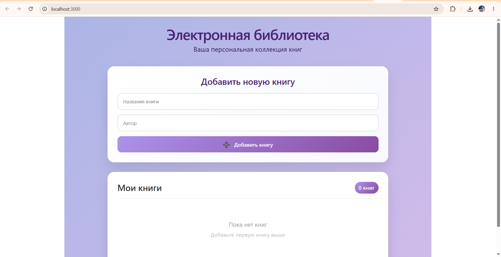

# Веб-приложение для управления личной библиотекой
## В проекте используется: 
- Vue 3
- Vite 
- JavaScript 
- Docker
- FastAPI
- Nginx
## Внешний API
Open Library API (https://openlibrary.org/developers) - для поиска реальных книг по названию или автору

## Основные шаги:
1. Создание проекта c помощью команды `npm create vite@latest weblib`
2. Добавление Dockerfile, index.html, nginx.conf, vite.config.js и их настройка
3. Сборка проекта с помощью команды `npm run build`
4. Локальный запуск проекта с помощью команды `npm run dev`
5. Запуск проекта через Docker: `docker-compose up --build`

## Скриншот приложения

